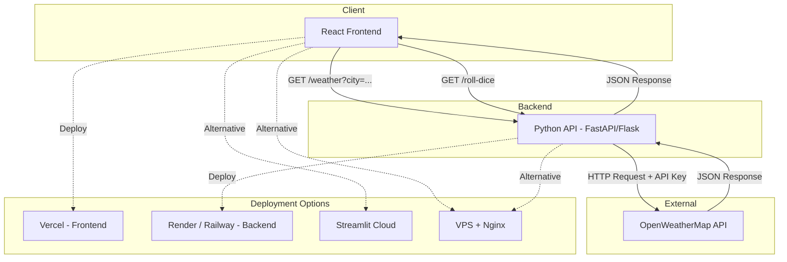

# Business Requirements & Implementation Guide

## Project Overview

A demo web application combining a **Weather Information** feature and a **Dice Simulator**, built with a React frontend and Python backend. The goal is to experiment with multiple deployment options (Streamlit, Vercel, VPS/Nginx) as a learning exercise.

---

## Application Features

### 1. Weather Information

Connect to a free weather API (e.g., [OpenWeatherMap](https://openweathermap.org/api)) to display current weather data.

**User interactions:**
- Enter a city name in a text input field
- Press Enter or click a **Get Weather** button
- Retrieve and display the current temperature for the selected city
- Display temperature in a clear, readable format (°C and/or °F)

**API Key Setup:**
- Register for a free account at [https://openweathermap.org/api](https://openweathermap.org/api)
- Generate a free-tier API key from your account dashboard
- Store the key in an `.env` file as `WEATHER_API_KEY=your_key_here`
- The backend reads this variable at runtime — never commit `.env` to version control

---

### 2. Dice Simulator

A simple dice game with two dice.

**Requirements:**
- A **Roll Dice** button to trigger a roll
- Simple rolling animation on button click
- Display the result of each die separately
- Display the total sum of both dice
- Allow the user to roll again as many times as desired (no limit)

---

## Technical Stack

| Layer     | Technology            |
|-----------|-----------------------|
| Frontend  | React (JavaScript)    |
| Backend   | Python (FastAPI or Flask) |
| Styling   | CSS / Tailwind (optional) |
| API       | OpenWeatherMap (free tier) |

---

## Project Structure

```
exercise2/
├── frontend/                  # React application
│   ├── public/
│   ├── src/
│   │   ├── components/
│   │   │   ├── Weather.jsx
│   │   │   └── DiceSimulator.jsx
│   │   ├── App.jsx
│   │   └── main.jsx
│   ├── package.json
│   ├── .env                   # REACT_APP_API_URL=...
│   └── vercel.json            # Vercel deployment config
│
├── backend/                   # Python API
│   ├── main.py                # FastAPI or Flask app
│   ├── requirements.txt
│   └── .env                   # WEATHER_API_KEY=...
│
├── streamlit_app/             # Standalone Streamlit version
│   ├── app.py
│   └── requirements.txt
│
├── nginx/                     # VPS deployment config (optional)
│   └── default.conf
│
├── .gitignore
└── README.md
```

---

## Architecture Diagram



---

## Required Files to Generate

| File | Purpose |
|------|---------|
| `frontend/src/App.jsx` | Main React app with routing |
| `frontend/src/components/Weather.jsx` | Weather feature component |
| `frontend/src/components/DiceSimulator.jsx` | Dice game component |
| `frontend/package.json` | Node dependencies |
| `frontend/.env` | Frontend environment variables |
| `frontend/vercel.json` | Vercel config for SPA routing |
| `backend/main.py` | Python API (weather + dice endpoints) |
| `backend/requirements.txt` | Python dependencies |
| `backend/.env` | Backend environment variables |
| `streamlit_app/app.py` | Standalone Streamlit version |
| `streamlit_app/requirements.txt` | Streamlit dependencies |
| `nginx/default.conf` | Nginx reverse proxy config |
| `.gitignore` | Ignore node_modules, .env, __pycache__ |
| `README.md` | Full setup, run, and deployment guide |

---

## Environment Variables

### Backend (`backend/.env`)
```
WEATHER_API_KEY=your_openweathermap_api_key
```

### Frontend (`frontend/.env`)
```
REACT_APP_API_URL=http://localhost:8000
```

> **Note:** For Vercel deployment, set these variables in the Vercel project dashboard under **Settings → Environment Variables**.

---

## Local Development Setup

### Prerequisites
- Node.js 18+ and npm
- Python 3.10+
- Git

### Backend
```bash
cd backend
python -m venv venv
venv\Scripts\activate        # Windows
pip install -r requirements.txt
cp .env.example .env         # Add your API key
uvicorn main:app --reload    # Starts on http://localhost:8000
```

### Frontend
```bash
cd frontend
npm install
cp .env.example .env         # Set REACT_APP_API_URL
npm run dev                  # Starts on http://localhost:5173
```

### Streamlit (standalone)
```bash
cd streamlit_app
pip install -r requirements.txt
streamlit run app.py
```

---

## Deployment Instructions

### Option 1: Vercel (Frontend) + Render (Backend)

1. **Push code to GitHub:**
   ```bash
   git init
   git add .
   git commit -m "Initial commit"
   git remote add origin https://github.com/your-username/your-repo.git
   git push -u origin main
   ```

2. **Deploy Backend to Render:**
   - Go to [https://render.com](https://render.com) and create a new **Web Service**
   - Connect your GitHub repository
   - Set the root directory to `backend/`
   - Build command: `pip install -r requirements.txt`
   - Start command: `uvicorn main:app --host 0.0.0.0 --port $PORT`
   - Add `WEATHER_API_KEY` under **Environment Variables**
   - Copy the deployed URL (e.g., `https://your-app.onrender.com`)

3. **Deploy Frontend to Vercel:**
   - Go to [https://vercel.com](https://vercel.com) and import your GitHub repository
   - Set root directory to `frontend/`
   - Add environment variable: `REACT_APP_API_URL=https://your-app.onrender.com`
   - Click **Deploy**

---

### Option 2: Streamlit Cloud

1. Push code to GitHub (see step 1 above)
2. Go to [https://streamlit.io/cloud](https://streamlit.io/cloud)
3. Click **New app** → connect your GitHub repo
4. Set the main file path to `streamlit_app/app.py`
5. Add `WEATHER_API_KEY` under **Secrets** (TOML format):
   ```toml
   WEATHER_API_KEY = "your_key_here"
   ```
6. Click **Deploy**

---

### Option 3: VPS with Nginx (Optional)

1. SSH into your VPS and install dependencies:
   ```bash
   sudo apt update && sudo apt install -y nginx python3-pip nodejs npm
   ```

2. Clone the repository and install dependencies (backend + frontend build)

3. Copy `nginx/default.conf` to `/etc/nginx/sites-available/default`

4. Restart Nginx:
   ```bash
   sudo systemctl restart nginx
   ```

5. Run the Python backend with a process manager:
   ```bash
   pip install gunicorn
   gunicorn -w 4 -k uvicorn.workers.UvicornWorker main:app
   ```

---

## Testing Instructions

### Backend API
```bash
# Test weather endpoint
curl "http://localhost:8000/weather?city=London"

# Test dice endpoint
curl "http://localhost:8000/roll-dice"
```

### Frontend
- Open `http://localhost:5173` in a browser
- Enter a city name and verify weather data displays correctly
- Click **Roll Dice** and verify both dice values and sum are shown
- Roll multiple times to confirm it works repeatedly

### Streamlit
- Open `http://localhost:8501` in a browser
- Test all features interactively

---

## Git & GitHub Setup

```bash
# Initialize repo
git init

# Create .gitignore first (important!)
# Then stage and commit
git add .
git commit -m "feat: initial project setup"

# Create repo on GitHub (via web UI or GitHub CLI)
gh repo create your-repo-name --public

# Push
git remote add origin https://github.com/your-username/your-repo-name.git
git push -u origin main
```

---

## Acceptance Criteria

- [ ] User can enter a city name and see the current temperature
- [ ] Weather errors (invalid city, API failure) are handled gracefully
- [ ] User can roll two dice and see individual values and the sum
- [ ] Dice animation plays on each roll
- [ ] Application runs locally without errors
- [ ] Application deploys successfully to Vercel and/or Streamlit Cloud
- [ ] No API keys or secrets are committed to the repository
- [ ] README contains complete setup and deployment instructions
